title: Construint comunitats acollidores
class: animation-fade
layout: true

---

class: impact

# {{title}}

---

## Coopdevs

Pau Pérez

* a [Coopdevs](http://coopdevs.org/)

.right[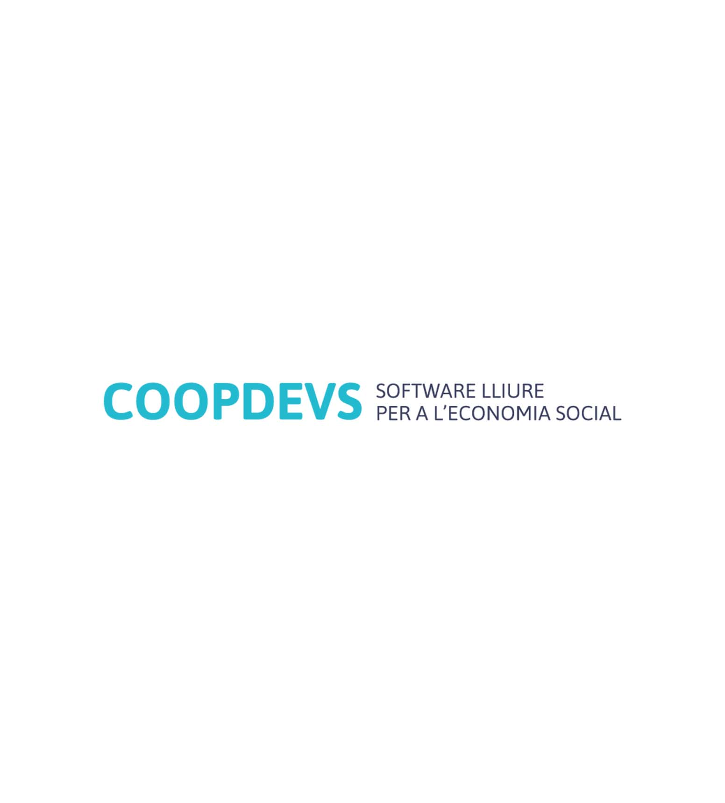]

[github.com/coopdevs](https://github.com/coopdevs)
[community.coopdevs.org](http://community.coopdevs.org/)

---

background-image: url(images/coopdevs.jpg)

.bottom-bar[Coopdevs]

---

## Katuma

Sí home, els que fan allò de consum de proximitat


---

# Ajudeu-nos al matchfunding!

[goteo.org/project/katuma](goteo.org/project/katuma)

---

background-image: url(images/technology.jpg)

## Tecnologia

.bottom-bar[Photo by Johannes Plenio on Unsplash]

---

## Sistemes de control de versions

Reusem i desenvolupem codi de manera col·laborativa

---

## GitHub & GitLab

Plataformes de desenvolupament de software

* Allotjament de repositoris
* Revisió del codi
* Gestió del projecte
* *Social coding*
* Llicència*

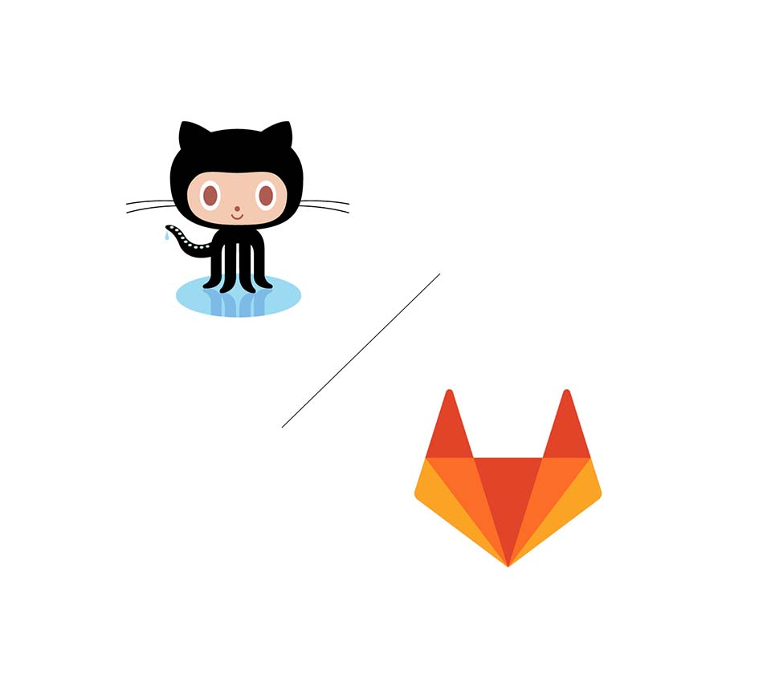

---

## Social coding

El treball en comunitat que es construeix sobre el software

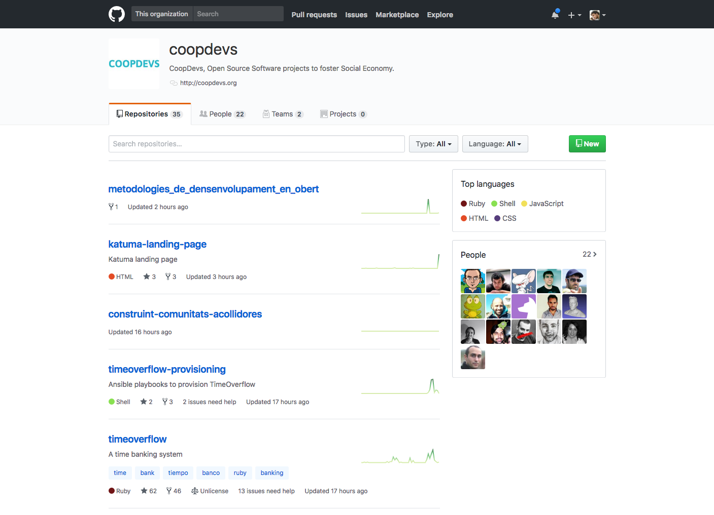

---

## Simbiosi


[.footer: Photo by Larm Rmah on Unsplash]

---

## Simbiosi

Projecte & Contribuïdor

---

## Simbiosi 

Projecte amplia els seus recursos humans

---

## Simbiosi

Contribuïdor aprèn i/o fa CV

---

## Humans

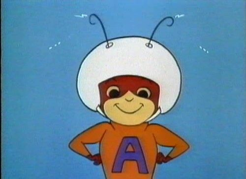

---

## Humans

Els projectes els fan persones

---

### Humans

Tenen sentiments i ànim

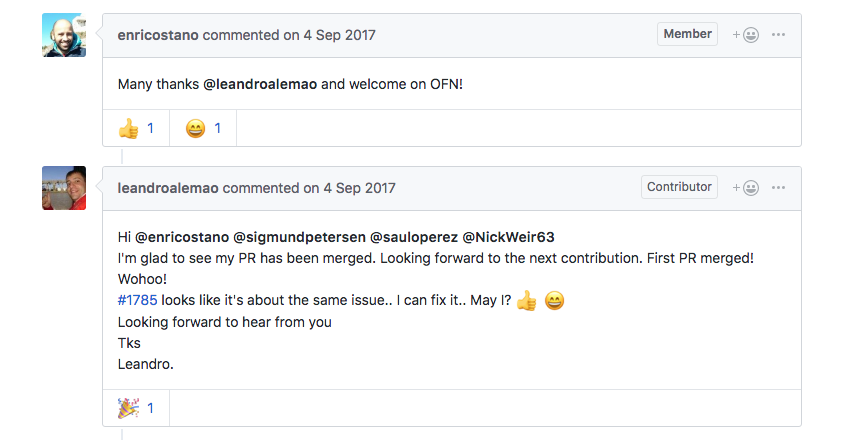

---

### Humans

Tenen sentiments i ànim

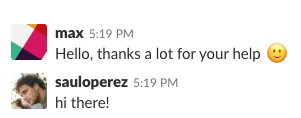

---

### Humans

Dóna les gràcies


---

## Humans

Ens costa estructurar i
comunicar idees abstractes

---

## Organització


[.footer: Photo by Patrick Perkins on Unsplash]

---

## Organització

Mantenir llistat d'*issues* perfectament detallats

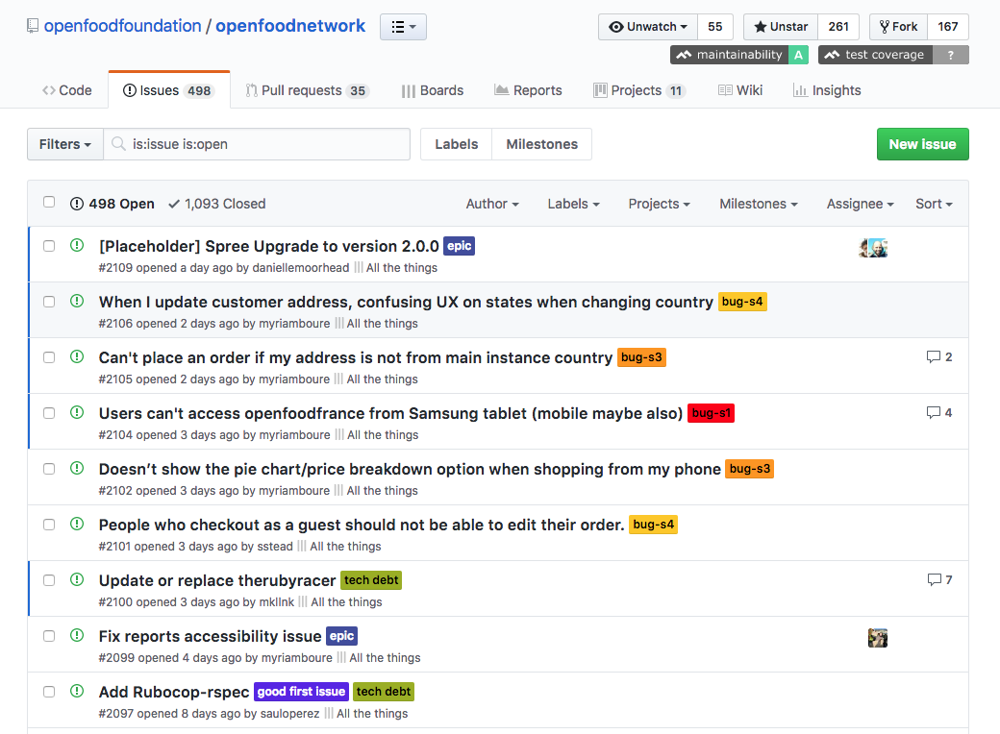

---

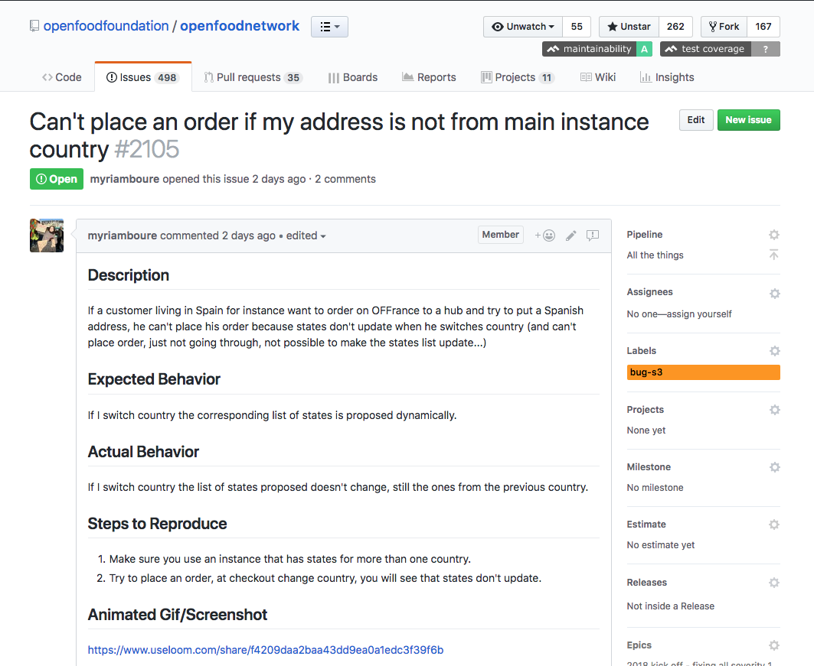

---

## Organització

Hi ha tasques més enllà del software

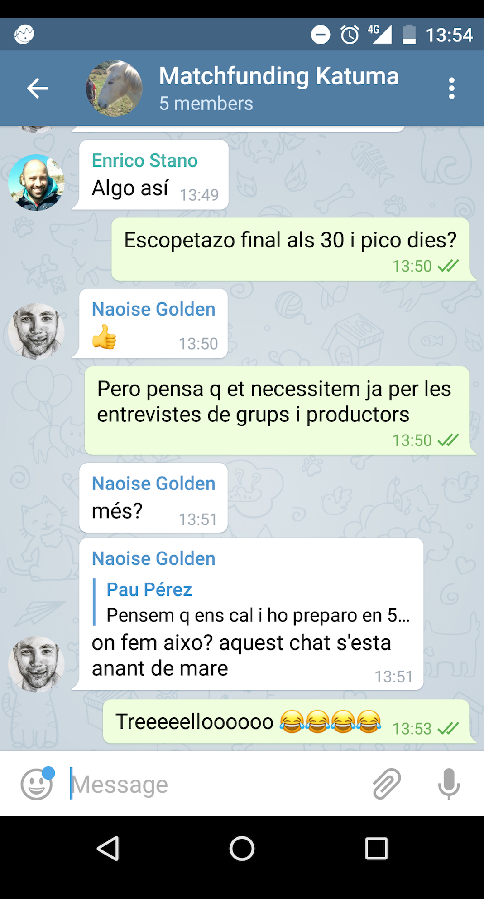

---

Software de gestió de projectes

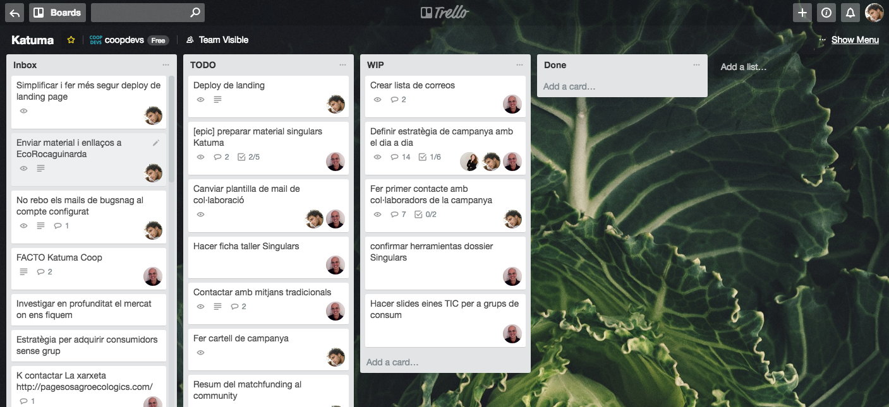

---

## Àgil i obert


[.footer: Photo by Erik Odiin on Unsplash]

---

## Àgil i obert

*Desenvolupament veloç i concurrent*
=>
Efectivitat i felicitat

---

## Àgil i obert

*Encoratjar, facilitar i acompanyar*
=>
Comunitats acollidores

---


---

## Processos

Fes les coses aburrides i repetitives

---

## Processos

```shell
$ automatitza
```

[.footer: vigileu]

---

## Documentació

El projecte ha de seguir
tot i que tu tinguis amnèsia

---

## Documentació

* No ho recordem tot
* Més gent si ha de poder sumar

---

No emmagatzemis res al teu cap

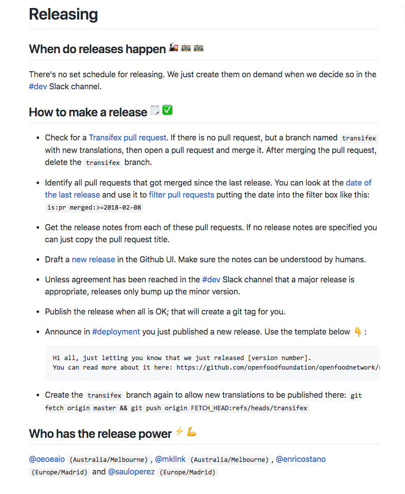

---

Fes la documentació executable


---

## Preguntes


[.footer: Photo by Matthias Heil on Unsplash]

---

Materials de la sessió a

[https://github.com/coopdevs/construint-comunitats-acollidores](https://github.com/coopdevs/construint-comunitats-acollidores)

---

## Gràcies
